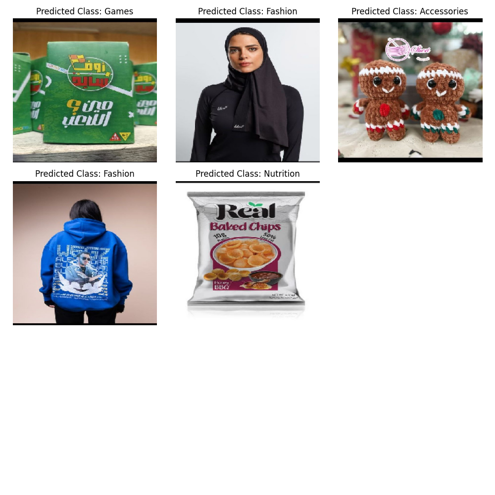

# Slash_Intern
Building a Product Image Classifier

Data Collection:
        ◦ Snapshots were taken from different categories in the Slash app.
        ◦ Images were split into 4 categories:
            ▪ 0 => Nutrition
            ▪ 1 => Fashion
            ▪ 2 => Games
            ▪ 3 => Accessories
        ◦ These categories were chosen as a proof of concept and for ease of expanding the model to handle more categories. They also have high-quality images requiring less preprocessing.

    • Choosing the Model:
        ◦ Due to the small dataset, training a model from scratch was not feasible.
        ◦ Pretrained models were considered, such as ResNet, MobileNet, and VGG.
        ◦ VGG16 was selected as it showed the best performance for the use case.
        ◦ The weights were frozen, and only the last layer was fine-tuned using softmax.
        ◦ Training accuracy was 100%, but test accuracy was around 92%, indicating some overfitting. This can be addressed by adding more training examples.
    
    • Save the Model:
        ◦ The trained model was saved for future inference.
    • Inference on Different Images:
        ◦ Inference was performed on four different images, and the results are as follows: 

